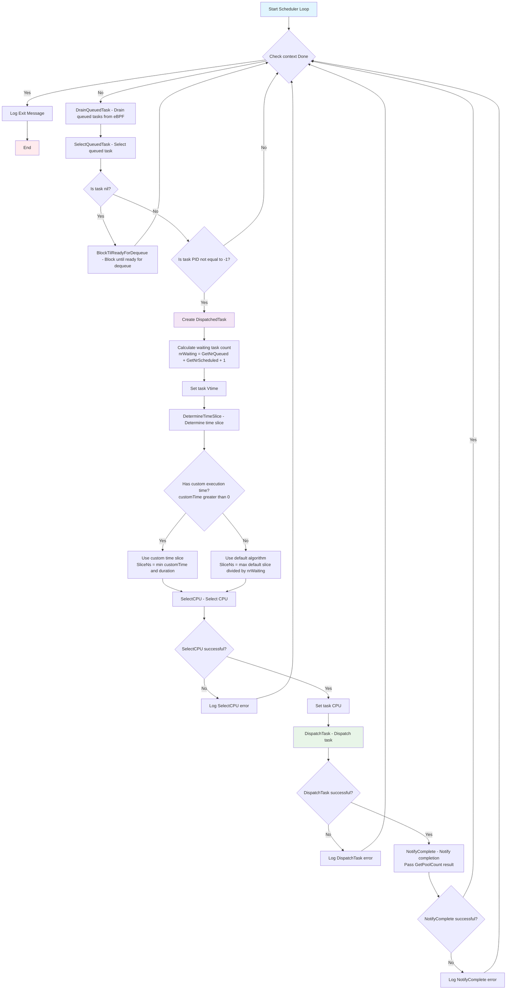
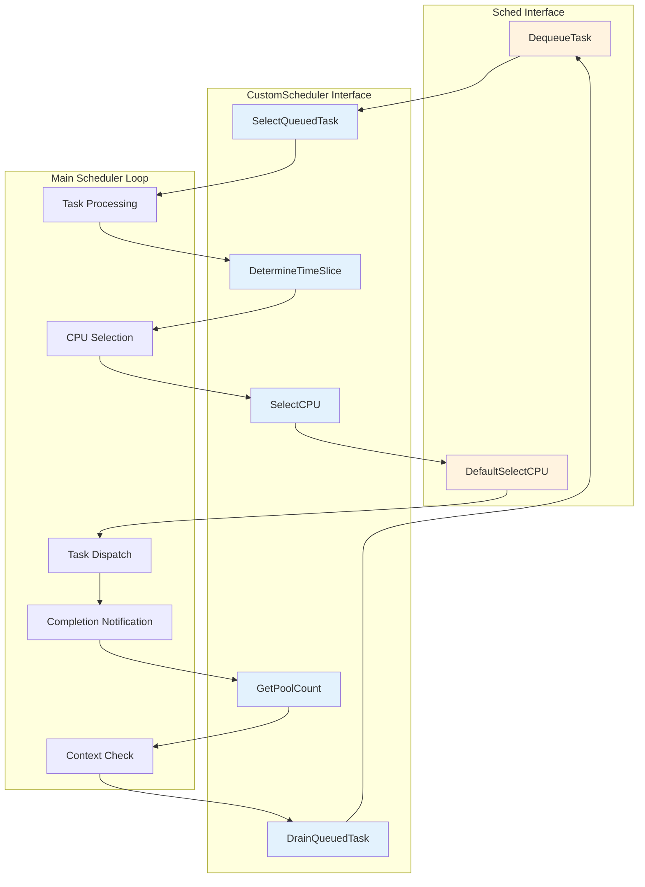

# Plugin

This repo collects all of scheduler implementations for Gthulhu project.

## Gthulhu Plugin Execution Flow

The following diagram shows the main execution flow after Gthulhu loads the plugin:



## Plugin Interface Functions

The following diagram shows the relationship between the plugin interface functions defined in `plugin.go`:



### Flow Description

1. **Main Loop**: The program runs in an infinite loop until receiving a context cancellation signal
2. **Task Draining**: Uses `DrainQueuedTask()` to drain queued tasks from eBPF
3. **Task Selection**: Selects tasks to process through `SelectQueuedTask()`
4. **Blocking Wait**: If no tasks are available, blocks until tasks are ready for dequeue
5. **Time Slice Calculation**: 
   - First attempts to get custom time slice using `DetermineTimeSlice()`
   - If no custom time is available, uses default algorithm to calculate time slice
6. **CPU Selection**: Uses `SelectCPU()` to select appropriate CPU for the task
7. **Task Dispatch**: Dispatches tasks to selected CPU through `DispatchTask()`
8. **Completion Notification**: Uses `NotifyComplete()` to notify system of task completion status

### Interface Functions Description

#### Sched Interface
- **`DequeueTask(task *models.QueuedTask)`**: Called by `DrainQueuedTask` to retrieve pending tasks sent up from eBPF
- **`DefaultSelectCPU(t *models.QueuedTask) (error, int32)`**: Provides default CPU selection logic when custom selection is not available

#### CustomScheduler Interface
- **`DrainQueuedTask(s Sched) int`**: Drains queued tasks from eBPF by calling `s.DequeueTask()` to retrieve pending tasks and returns the number of tasks drained
- **`SelectQueuedTask(s Sched) *models.QueuedTask`**: Selects and returns a task from the queued tasks for processing
- **`SelectCPU(s Sched, t *models.QueuedTask) (error, int32)`**: Selects the most appropriate CPU for the given task
- **`DetermineTimeSlice(s Sched, t *models.QueuedTask) uint64`**: Calculates the time slice duration for task execution
- **`GetPoolCount() uint64`**: Returns the number of tasks waiting to be dispatched in the pool

The plugin architecture allows custom scheduler implementations to override default behavior while maintaining compatibility with the core Gthulhu scheduler framework.

## Factory Pattern

This repository implements a factory pattern for plugin creation, allowing dynamic plugin registration and instantiation without hardcoded switch-case logic in the Gthulhu main repository.

### Quick Start

```go
import (
    "github.com/Gthulhu/plugin/plugin"
    // Import plugins to trigger registration
    _ "github.com/Gthulhu/plugin/plugin/gthulhu"
    _ "github.com/Gthulhu/plugin/plugin/simple"
)

// Create a scheduler plugin using the factory
config := &plugin.SchedConfig{
    Mode:           "gthulhu",
    SliceNsDefault: 5000 * 1000,  // 5ms
    SliceNsMin:     500 * 1000,   // 0.5ms
}

scheduler, err := plugin.NewSchedulerPlugin(config)
if err != nil {
    log.Fatalf("Failed to create plugin: %v", err)
}

// Use the scheduler
scheduler.DrainQueuedTask(sched)
```

### Available Plugins

| Mode | Description |
|------|-------------|
| `gthulhu` | Advanced scheduler with API integration and scheduling strategies |
| `simple` | Simple weighted vtime scheduler |
| `simple-fifo` | Simple FIFO scheduler |

### Configuration

The `SchedConfig` struct holds all configuration parameters:

```go
type SchedConfig struct {
    Mode           string  // Plugin mode to use
    SliceNsDefault uint64  // Default time slice in nanoseconds
    SliceNsMin     uint64  // Minimum time slice in nanoseconds
    FifoMode       bool    // Enable FIFO mode for simple plugin
    
    // Scheduler configuration (for Gthulhu plugin)
    Scheduler struct {
        SliceNsDefault uint64
        SliceNsMin     uint64
    }
    
    // API configuration (for Gthulhu plugin)
    APIConfig struct {
        PublicKeyPath string
        BaseURL       string
    }
}
```

### Creating New Plugins

To add a new plugin:

1. Implement the `CustomScheduler` interface
2. Register your plugin in `init()`:

```go
func init() {
    plugin.RegisterNewPlugin("myplugin", func(config *plugin.SchedConfig) (plugin.CustomScheduler, error) {
        return NewMyPlugin(config), nil
    })
}
```

3. Import your plugin package to trigger registration

## Testing

Run tests with coverage:

```bash
# Run all tests
go test ./... -v

# Check coverage
go test ./... -coverprofile=coverage.out
go tool cover -func=coverage.out

# View coverage in browser
go tool cover -html=coverage.out
```

