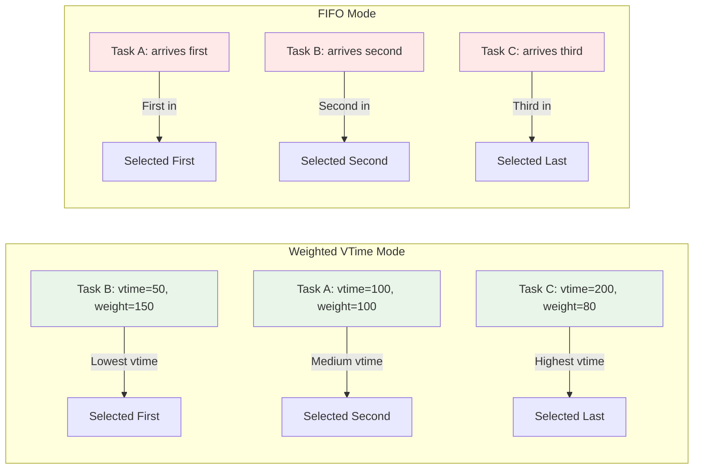
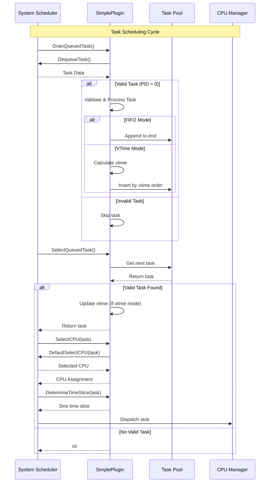
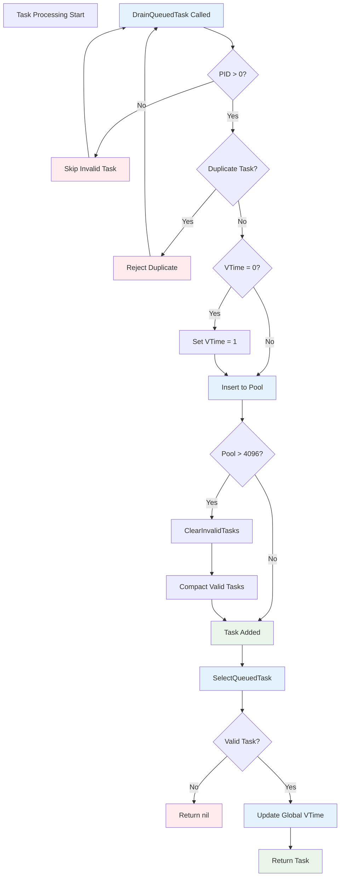

# Simple Scheduler Plugin

A basic scheduler implementation inspired by the simple BPF scheduler from the Linux kernel's sched_ext framework. This Go implementation provides a clean, efficient task scheduling solution with dual-mode operation.

## Overview

The Simple Scheduler Plugin implements a lightweight, high-performance task scheduler that can operate in two distinct modes:

1. **Weighted Virtual Time Scheduling** (default) - Fair scheduling based on task weights and virtual time
2. **FIFO Scheduling** - First-In-First-Out scheduling for specific workloads

## Features

### Core Functionality
- **Dual-mode operation**: Switch between weighted vtime and FIFO scheduling
- **Dynamic slice-based task pool**: Efficient task management with up to 4096 task capacity
- **Virtual time tracking**: Global vtime progression for fair scheduling (never 0)
- **Robust task validation**: Prevents invalid tasks and duplicate dispatch
- **Statistics tracking**: Monitor local and global queue metrics
- **Fixed time slice**: 5ms default time slice for all tasks

### Scheduling Modes

#### Weighted Virtual Time Scheduling
- Tasks are scheduled based on their virtual time (vtime) and weight
- Lower vtime tasks get higher priority
- **vtime is never 0** - minimum value is 1 to prevent scheduling anomalies
- Prevents idle tasks from accumulating excessive budget
- Global vtime progresses as tasks execute and starts at 1
- Execution time is scaled by task weight

#### FIFO Scheduling
- Simple first-in-first-out task ordering
- No vtime calculations or weight considerations
- Suitable for workloads where order of arrival matters
- Lower overhead compared to weighted vtime mode

## Architecture

### System Overview

```mermaid
graph TB
    subgraph "Simple Scheduler Plugin"
        SP[SimplePlugin Instance]
        subgraph "Configuration"
            FM[fifoMode: bool]
            SD[sliceDefault: 5ms]
        end
        
        subgraph "Task Pool Management"
            TP[taskPool: []Task]
            VT[vtimeNow: uint64]
        end
        
        subgraph "Statistics"
            LC[localQueueCount]
            GC[globalQueueCount]
        end
    end
    
    subgraph "External Interfaces"
        SCHED[System Scheduler]
        EBPF[eBPF Queue]
        CPU[CPU Assignment]
    end
    
    subgraph "Scheduling Flow"
        DRAIN[DrainQueuedTask]
        SELECT[SelectQueuedTask]
        SELECTCPU[SelectCPU]
        TIMESLICE[DetermineTimeSlice]
    end
    
    EBPF -->|DequeueTask| DRAIN
    DRAIN -->|Insert Tasks| TP
    TP -->|Get Next Task| SELECT
    SELECT -->|Task Ready| SELECTCPU
    SELECTCPU -->|CPU Selected| SCHED
    TIMESLICE -->|5ms Slice| SCHED
    
    SP --> FM
    SP --> SD
    SP --> TP
    SP --> VT
    SP --> LC
    SP --> GC
    
    classDef plugin fill:#e1f5fe
    classDef external fill:#fff3e0
    classDef flow fill:#f3e5f5
    
    class SP,FM,SD,TP,VT,LC,GC plugin
    class SCHED,EBPF,CPU external
    class DRAIN,SELECT,SELECTCPU,TIMESLICE flow
```

### Scheduling Mode Comparison



### Task Processing Pipeline



### Core Components

```go
type SimplePlugin struct {
    fifoMode     bool     // Scheduling mode flag
    sliceDefault uint64   // Default time slice (5ms)
    taskPool     []Task   // Dynamic slice for tasks
    vtimeNow     uint64   // Global virtual time tracker
    // Statistics and pool management fields...
}
```

### Error Handling & Recovery



### Task Management
- **Task Pool**: Dynamic slice implementation with automatic growth/shrinkage
- **Insertion Logic**: 
  - FIFO mode: Append to end of slice
  - Weighted vtime mode: Insert in vtime-sorted order using slice operations
- **Selection Logic**: Always select from front of slice
- **Error Recovery**: Automatic cleanup of invalid tasks and duplicate prevention

### Interface Compliance
Fully implements the `plugin.CustomScheduler` interface:
- `DrainQueuedTask()` - Drain tasks from system queue to local pool
- `SelectQueuedTask()` - Select next task for execution
- `SelectCPU()` - Always select any CPU (returns 1<<20)
- `DetermineTimeSlice()` - Return fixed 5ms time slice
- `GetPoolCount()` - Return current task pool size

## Usage

### Basic Usage

```go
// Create weighted vtime scheduler (default)
scheduler := NewSimplePlugin(false)

// Create FIFO scheduler
fifoScheduler := NewSimplePlugin(true)

// Switch modes at runtime
scheduler.SetMode(true)  // Switch to FIFO
scheduler.SetMode(false) // Switch to weighted vtime
```

### Integration with Scheduler Framework

```go
// Drain tasks from system queue
drained := scheduler.DrainQueuedTask(systemScheduler)

// Select next task for execution
task := scheduler.SelectQueuedTask(systemScheduler)

// Get CPU assignment
err, cpu := scheduler.SelectCPU(systemScheduler, task)

// Get time slice
timeSlice := scheduler.DetermineTimeSlice(systemScheduler, task)
```

### Statistics Monitoring

```go
// Get queue statistics
local, global := scheduler.GetStats()
fmt.Printf("Local: %d, Global: %d\n", local, global)

// Reset statistics
scheduler.ResetStats()

// Get current pool size
poolSize := scheduler.GetPoolCount()
```

## Testing

The package includes comprehensive tests covering:

### Unit Tests
- **Instance Isolation**: Multiple scheduler instances maintain independent state
- **Configuration Management**: Default settings and mode switching
- **Task Pool Operations**: Initialization, insertion, and retrieval
- **Statistics Tracking**: Counter updates and reset functionality

### Integration Tests
- **Runtime Simulation**: End-to-end scheduling workflows
- **Mode-specific Behavior**: FIFO vs weighted vtime scheduling differences
- **Edge Cases**: Empty queues, pool overflow, concurrent operations
- **Virtual Time Updates**: Proper vtime progression and task charging

### Mock Framework
Includes `MockScheduler` for isolated testing:
- Task queue simulation
- CPU allocation tracking  
- Operation counting
- State reset capabilities

## Performance Characteristics

### Time Complexity
- **Task Insertion**: 
  - FIFO mode: O(1) amortized (slice append)
  - Weighted vtime mode: O(n) where n is current pool size
- **Task Selection**: O(1) with slice reslicing
- **Pool Management**: O(1) amortized for most operations

### Memory Usage
- Dynamic memory footprint: grows/shrinks based on actual task count
- Pre-allocated capacity up to 4096 tasks to minimize reallocations
- Automatic garbage collection of completed tasks
- Minimal per-task metadata overhead

### Scalability
- Shared queue across all CPUs ensures fair distribution
- May benefit interactive workloads in FIFO mode
- Good performance on systems with sufficient CPU count

## Limitations

1. **No Preemption**: Tasks run until completion or yield
2. **Fixed Time Slice**: All tasks get the same 5ms time slice
3. **Simple CPU Selection**: Always selects any CPU (returns 1<<20)
4. **FIFO Saturation**: In FIFO mode, CPU-intensive tasks can starve interactive tasks

## Comparison with Reference Implementation

This Go implementation closely follows the behavior of the Linux kernel's simple BPF scheduler:

### Similarities
- Dual-mode operation (weighted vtime vs FIFO)
- Virtual time progression and task charging
- Budget limiting for idle tasks
- Statistics tracking
- Similar algorithmic approach

### Differences
- **Language**: Go vs C/BPF
- **Environment**: Userspace vs kernel space
- **CPU Selection**: Delegated vs direct DSQ management
- **Memory Management**: Go GC vs manual memory management
- **Task Pool**: Circular buffer vs eBPF maps

## Contributing

When contributing to this scheduler:

1. Maintain interface compatibility with `plugin.CustomScheduler`
2. Add appropriate test coverage for new features
3. Follow Go formatting conventions (`go fmt`)
4. Consider performance implications of changes
5. Update this README for significant changes